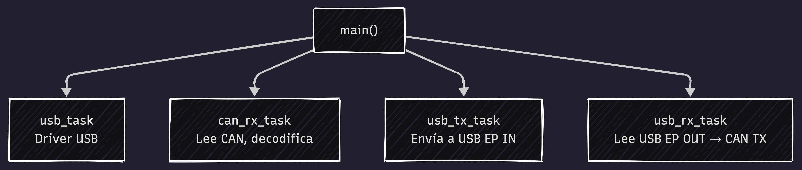

# Arquitectura del firmware

## Principios de diseño

1. **Separación por responsabilidad**: Cada crate tiene un único propósito
2. **Independencia de hardware**: La lógica de protocolo no sabe del chip
3. **Zero-copy donde importa**: `bytemuck` para serialización, canales Embassy para messaging
4. **Async everywhere**: Tareas Embassy cooperan sin bloquear el CPU

## Crates

<div align="center">
  
  <p><em>Estructura modular del firmware: firmware orquesta BSP, protocolo gs_usb y decodificación CAN.</em></p>
</div>

## Tareas Embassy

<div align="center">
  
  <p><em>Tareas asíncronas Embassy: USB driver, CAN RX, USB TX y USB RX (fase 2).</em></p>
</div>

## Canales

```
CAN_RX_CHANNEL:     Channel<CanFrame, 32>     CAN RX → USB TX
CAN_CTRL_CHANNEL:   Channel<CanCommand, 4>    USB Control → CAN config
```

`CanCommand` es un enum:
- `Start` — Habilita el controlador CAN
- `Stop` — Lo pone en modo silencio
- `SetBitTiming(GsDeviceBitTiming)` — Configura la velocidad

## Por qué este diseño

| Decisión | Razón |
|----------|-------|
| `Channel` en vez de `Mutex+Queue` | Embassy channels son lock-free y async-aware |
| `CriticalSectionRawMutex` | Funciona en interrupt context (CAN RX puede venir de IRQ) |
| `#[repr(C)]` + `Pod` en frames | Serialización zero-copy al USB, compatible con el driver Linux |
| Separar gs_usb_protocol del BSP | Permite testear el handler de control transfers en host sin hardware |
| Buffer de 32 en CAN_RX_CHANNEL | Absorbe ráfagas típicas de diagnóstico (flash, lectura masiva de PIDs) |
| Endpoint IN de 64 bytes | Máximo para USB Full Speed, un GsHostFrame cabe exacto (20 bytes) |
