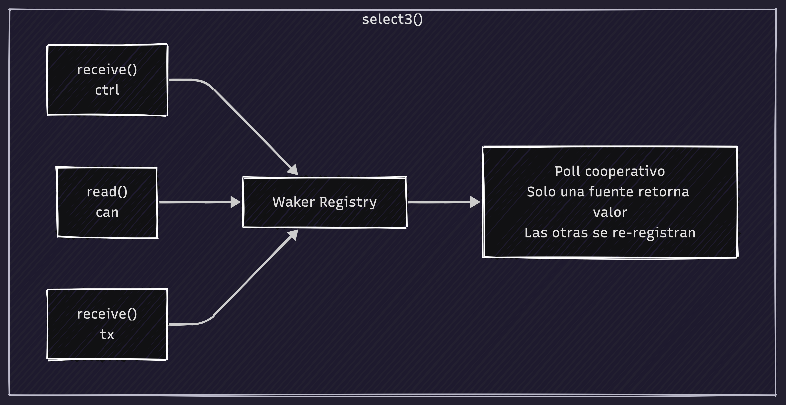

# Diseño de Canales - Patrones de Comunicación

## Visión General

El firmware usa `embassy_sync::channel` para comunicación asíncrona entre tareas. Este documento describe el diseño, patrones y consideraciones de performance.

## Patrón: Productor-Consumidor con Canales

### Concepto

<div align="center">
  
  <p><em>Patrón Productor-Consumidor: comunicación asíncrona vía Channel con buffer circular.</em></p>
</div>

### Ventajas

1. **Desacoplamiento:** Las tareas no conocen unas de otras
2. **Sin bloqueo:** `send().await` suspende sin bloquear el executor
3. **Buffer circular:** Absorbe picos de tráfico
4. **Type safety:** El tipo del mensaje está codificado en tiempo de compilación

## Canales Implementados

### 1. CAN_RX_CHANNEL (32 mensajes)

**Propósito:** Tramas CAN recibidas del bus → USB host

```rust
static CAN_RX_CHANNEL: Channel<CriticalSectionRawMutex, CanFrame, 32> = Channel::new();
```

**Productor:** `can_rx_task` (cuando recibe del bus)
**Consumidor:** `usb_tx_task`

**Por qué 32 mensajes:**
- USB Full Speed: ~1ms por transferencia de 64 bytes
- CAN a 500kbps: ~1 trama cada 30-50μs (depende de longitud)
- 32 mensajes dan ~1ms de buffer en ráfaga máxima
- RAM: 32 × 20 bytes = 640 bytes

### 2. CAN_TX_CHANNEL (16 mensajes)

**Propósito:** Solicitudes de transmisión desde host USB → CAN

```rust
static CAN_TX_CHANNEL: Channel<CriticalSectionRawMutex, CanTxRequest, 16> = Channel::new();
```

**Productor:** `usb_rx_task`
**Consumidor:** `can_rx_task`

**Por qué 16 mensajes:**
- El host generalmente envía tramas una por una
- 16 es suficiente para burst cortos
- RAM: 16 × ~24 bytes = 384 bytes

### 3. USB_ECHO_CHANNEL (16 mensajes)

**Propósito:** Confirmaciones de TX enviadas → host

```rust
static USB_ECHO_CHANNEL: Channel<CriticalSectionRawMutex, GsHostFrame, 16> = Channel::new();
```

**Productor:** `can_rx_task` (después de transmitir)
**Consumidor:** `usb_tx_task`

**Por qué 16 mensajes:**
- Debe coincidir con CAN_TX_CHANNEL
- Cada TX genera un echo
- RAM: 16 × 20 bytes = 320 bytes

### 4. CAN_CTRL_CHANNEL (4 mensajes)

**Propósito:** Comandos de configuración start/stop/timing

```rust
static CAN_CTRL_CHANNEL: Channel<CriticalSectionRawMutex, CanCommand, 4> = Channel::new();
```

**Productor:** Callbacks de `GsUsbControlHandler`
**Consumidor:** `can_rx_task`

**Por qué 4 mensajes:**
- Comandos esporádicos (start, stop, configuración)
- No hay ráfagas de comandos
- RAM: 4 × ~12 bytes = 48 bytes

## Patrón: select3() en can_rx_task

### Problema

`can_rx_task` debe escuchar 3 fuentes simultáneamente:
1. Comandos de configuración (CAN_CTRL_CHANNEL)
2. Tramas del bus CAN (can.read())
3. Solicitudes de transmisión (CAN_TX_CHANNEL)

### Solución

```rust
match select3(
    CAN_CTRL_CHANNEL.receive(),  // Fuente 1
    can.can.read(),              // Fuente 2
    CAN_TX_CHANNEL.receive()     // Fuente 3
).await {
    Either3::First(cmd) => { /* Manejar comando */ }
    Either3::Second(result) => { /* Manejar RX del bus */ }
    Either3::Third(tx_req) => { /* Manejar TX */ }
}
```

### Cómo funciona select3()

<div align="center">
  
  <p><em>select3() consulta 3 fuentes simultáneas de forma cooperativa y fair.</em></p>
</div>
┌─────────────────────────────────────────────────────┐
│                    select3()                        │
├─────────────────────────────────────────────────────┤
│                                                     │
│  ┌──────────┐  ┌──────────┐  ┌──────────┐        │
│  │ receive()│  │  read()  │  │ receive()│        │
│  │  ctrl    │  │   can    │  │   tx     │        │
│  └────┬─────┘  └────┬─────┘  └────┬─────┘        │
│       │              │              │              │
│       ▼              ▼              ▼              │
│  ┌─────────────────────────────────────────────┐  │
│  │          Waker Registry                     │  │
│  │  - Registra wakers de cada operación        │  │
│  └─────────────────────────────────────────────┘  │
│                      │                            │
│                      ▼                            │
│  ┌─────────────────────────────────────────────┐  │
│  │          Poll (cooperative)                 │  │
│  │  - Solo una fuente retorna valor            │  │
│  │  - Las otras se re-registran para futuro    │  │
│  └─────────────────────────────────────────────┘  │
└─────────────────────────────────────────────────────┘
```

**Características:**
- No desperdicia CPU (polling no activo)
- Fair: todas las fuentes se consultan equitativamente
- Sin prioridad explícita (depende del orden de registro)

## Patrón: select() en usb_tx_task

### Problema

`usb_tx_task` debe enviar 2 tipos de tramas:
1. Tramas recibidas del bus (CAN_RX_CHANNEL)
2. Echoes de transmisión (USB_ECHO_CHANNEL)

### Solución

```rust
let host_frame = match select(
    CAN_RX_CHANNEL.receive(),
    USB_ECHO_CHANNEL.receive()
).await {
    Either::First(frame) => GsHostFrame::from_can_frame(...),
    Either::Second(echo) => echo,
};
```

## Patrones de Error Handling

### 1. try_send() en callbacks

```rust
fn on_start_cb() {
    let _ = CAN_CTRL_CHANNEL.try_send(CanCommand::Start);
}
```

**Razón:** Los callbacks se ejecutan en contexto de interrupción USB. `send().await` bloquearía. `try_send()` falla silenciosamente si la cola está llena, pero es seguro porque el comando no es crítico.

### 2. try_send() en usb_rx_task

```rust
match CAN_TX_CHANNEL.try_send(tx_req) {
    Ok(()) => {}
    Err(_) => warn!("Cola CAN TX llena"),
}
```

**Razón:** Si el CAN no puede absorber tramas tan rápido como el USB las recibe, la cola se llena. Es mejor descartar que bloquear el USB.

### 3. Result en transmit()

```rust
match can.transmit(...).await {
    Ok(()) => { /* Enviar echo */ }
    Err(e) => error!("Error TX"),
}
```

**Razón:** El hardware CAN puede fallar (ID inválido, bus off, etc.). Se loguea el error pero se continúa.

## Optimizaciones de Performance

### 1. Zero-Copy con bytemuck

```rust
// ❌ Copybyte-by-byte (lento)
let mut msg = GsTxMsg::default();
msg.echo_id = u32::from_le_bytes(buf[0..4].try_into().unwrap());
// ...

// ✅ Zero-copy (rápido)
let msg: GsTxMsg = bytemuck::pod_read_unaligned(&buf);
```

**Ahorro:** ~100 ciclos por trama en Cortex-M4

### 2. Capacidad de canales ajustada

| Canal | Capacidad | Justificación |
|-------|-----------|---------------|
| CAN_RX | 32 | Absorbe burst de CAN a 1Mbps |
| CAN_TX | 16 | Host generalmente envía 1 a 1 |
| ECHO | 16 | 1:1 con CAN_TX |
| CTRL | 4 | Comandos esporádicos |

### 3. Límite de DLC

```rust
pub fn dlc(&self) -> u8 {
    self.can_dlc.min(8)  // CAN clásico
}
```

**Prev:** Envío de datos inválidos al hardware

### 4. select3() en lugar de múltiples select()

```rust
// ❌select anidado (más overhead)
match select(ctrl, select(can_read, tx)).await { ... }

// ✅ select3() (más eficiente)
match select3(ctrl, can_read, tx).await { ... }
```

## Consideraciones de Timing

### Latencia del sistema

```
USB RX → usb_rx_task → CAN_TX_CHANNEL → can_rx_task → bxCAN
  │                                                  │
  └─ ~1ms (USB Full Speed)                          └─ ~30μs (CAN 500kbps)
                                                      
Total: ~1.03ms por trama
```

### Throughput máximo teórico

- CAN 500kbps: ~4,500 tramas/segundo (tramas de 8 bytes)
- USB Full Speed: ~1,000 transferencias/segundo × 64 bytes
- Botleneck: USB (no CAN)

### Jitter

- `select3()`: ~1μs de jitter por iteración
- `try_send()`: ~0.1μs (no bloquea)
- `ep_out.read()`: Variable (depende de USB stack)

## debugging

### Logs con defmt

```rust
info!("CAN: Configurando Bit Timing");
warn!("USB RX: Cola CAN TX llena");
error!("CAN TX: Error al transmitir");
```

### Métricas a monitorear

1. **Tasa de descartes en CAN_TX_CHANNEL:** Indica si el CAN es bottleneck
2. **Tasa de errores USB TX:** Indica si el host está leyendo
3. **Latencia end-to-end:** Medir con timestamps

## Futuras Mejoras

1. **BufferedCan:** Usar `embassy_stm32::can::BufferedCan` para mayor throughput
2. **Prioridades:** Asignar prioridades a tareas Embassy
3. **Power:** Integrar `embassy_usb` power management
4. **DMA:** Usar DMA para transferencias USB (si disponible)
5. **RTOS metrics:** Agregar contadores de mensajes procesados
