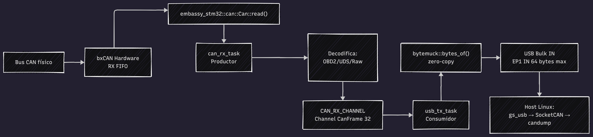
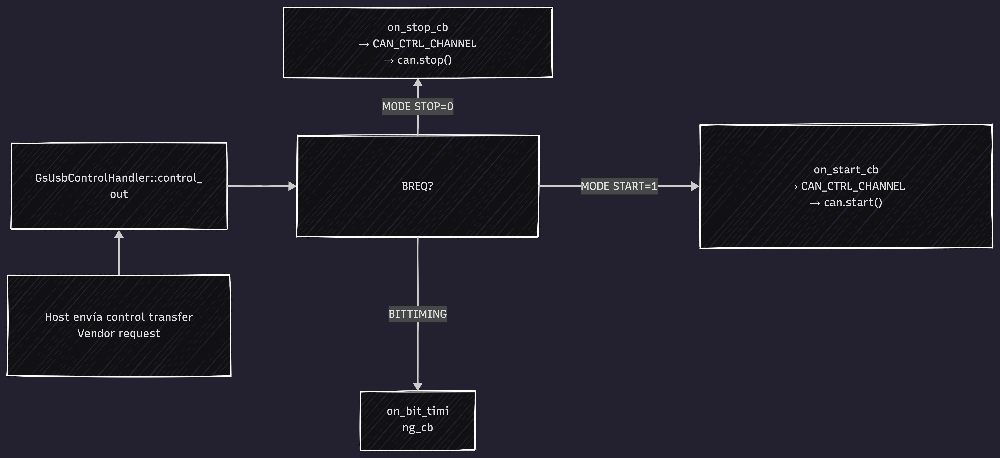
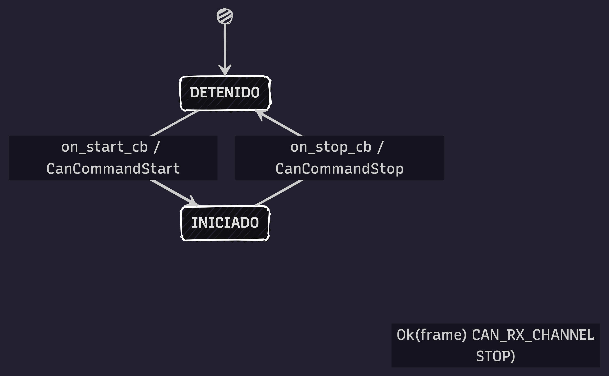

# Flujo de datos CAN → USB

Este documento describe cómo fluyen los datos desde el bus CAN físico hasta el host Linux, y cómo el host envía comandos de control al device.

---

## Recepción: Bus CAN → Host

Es el flujo principal del firmware. Cada trama que llega al bus CAN debe llegar al host lo más rápido posible, sin perder datos.

<div align="center">
  
  <p><em>Flujo completo de datos: desde el bus CAN físico hasta el host Linux vía SocketCAN.</em></p>
</div>

### Paso a paso

1. **bxCAN Hardware recibe la trama.** El controlador CAN del STM32F446 tiene un FIFO de hardware que almacena tramas recibidas. Cuando llega una trama válida, se dispara la interrupción RX0.

2. **`can.can.read()` convierte a formato genérico.** Embassy provee un driver async que lee del FIFO y devuelve un `Envelope` con los campos `id`, `data` y `dlc`. Esto abstrae los registros del hardware.

3. **`can_driver_task` extrae y encola.** La tarea actor lee la trama del bus, la convierte a `can_protocol::CanFrame`, y la mete en `CAN_RX_CHANNEL`. **No decodifica OBD2/UDS aquí** — eso se hace en `usb_tx_task` para mantener el driver CAN enfocado en el hardware.

4. **`CAN_RX_CHANNEL` absorbe ráfagas.** Es un buffer circular de 32 slots. Si el host no está leyendo (USB lento), la trama se queda en el buffer en lugar de perderse. Si el buffer se llena, `can_driver_task` se bloquea hasta que `usb_tx_task` libere un slot.

5. **`usb_tx_task` decodifica y serializa.** Consume `CAN_RX_CHANNEL`, decodifica OBD2/UDS para logging, y convierte `CanFrame` a `GsHostFrame` (ambos 20 bytes, `#[repr(C)]`). Usa `bytemuck::bytes_of()` para reinterpretar la memoria como bytes. No hay copia — solo un puntero reinterpretado.

6. **USB Bulk IN envía al host.** Escribe 20 bytes al endpoint IN. El host los recibe como una trama SocketCAN estándar.

### Por qué importa el diseño

- **Sin `alloc`:** No hay malloc/free. Los canales tienen tamaño fijo en tiempo de compilación.
- **Lock-free:** `embassy_sync::channel` usa interrupciones atómicas, no mutexes. `can_driver_task` puede correr en contexto de interrupción si fuera necesario.
- **Zero-copy:** La serialización con `bytemuck` evita copiar byte por byte. En un Cortex-M4 a 84MHz, esto ahorra ~50 ciclos por trama.
- **Separación de responsabilidades:** `can_driver_task` hace hardware; `usb_tx_task` hace protocolo y USB.

---

## Control: Host → Device

El host configura el device usando **control transfers** USB (vendor requests). Estos son los comandos que envía el driver `gs_usb` de Linux al conectar el dispositivo.

<div align="center">
  
  <p><em>Control transfers: configuración de bit timing, start y stop del controlador CAN.</em></p>
</div>

### Secuencia típica de inicialización

Cuando el usuario ejecuta `sudo ip link set can0 up`, el driver gs_usb realiza esta secuencia:

1. **`GS_USB_BREQ_BT_CONST`** — Pregunta al device: ¿qué frecuencia de reloj soportas? El firmware responde con `GsDeviceBtConst` (40 bytes) que incluye `fclk_can = 42MHz` y los límites de `tseg1`, `tseg2`, `sjw` y `brp`.

2. **`GS_USB_BREQ_BITTIMING`** — El driver calcula el bit timing óptimo para 500kbps y envía `GsDeviceBitTiming` al firmware. El callback `on_bit_timing_cb` lo enruta por `CAN_CMD_CHANNEL` hasta `can_driver_task`, que configura el hardware CAN.

3. **`GS_USB_BREQ_MODE` (START=1)** — Activa el controlador CAN. El callback `on_start_cb` envía `CanDriverCmd::Start` por el canal de comandos. `can_driver_task` llama a `can.start()` y comienza a escuchar el bus.

4. **`GS_USB_BREQ_MODE` (STOP=0)`** — Detiene el CAN. Útil para reconfigurar o apagar.

### Comandos adicionales soportados

Además de los BREQ requeridos por el driver del kernel, el handler implementa:

| BREQ | Tipo | Payload | Comportamiento |
|------|------|---------|----------------|
| `GS_USB_BREQ_TIMESTAMP` (6) | IN | u32 LE (ms desde boot) | Lee de `handler.now_ms()` — el firmware inyecta `embassy_time::Instant::now().as_millis() as u32` |
| `GS_USB_BREQ_IDENTIFY` (7) | OUT | `GsIdentifyMode` (u32) | Invoca `on_identify(true\|false)` **solo si** `capabilities` incluye `GS_CAN_FEATURE_IDENTIFY` |
| `GS_USB_BREQ_GET_USER_ID` (8) | IN | u32 LE | Devuelve `handler.user_id` |
| `GS_USB_BREQ_SET_USER_ID` (9) | OUT | u32 LE | Actualiza `handler.user_id` |
| `GS_USB_BREQ_DEV_CAPABILITIES` (11) | IN | `GsDeviceCapabilities` (4 B) | Endpoint no estándar; reporta el mismo bitfield de features que `BT_CONST` por un canal dedicado |

Si el host pide un BREQ no manejado o un BREQ con tipo no-vendor, el handler devuelve `None` para que el stack USB genere un STALL.

### Por qué usar canales para control

Los callbacks de USB corren en **contexto de interrupción**. No pueden hacer `await` (bloquear). Por eso usan `try_send()`: si la cola está llena, descarta silenciosamente. Para comandos esporádicos como start/stop esto es aceptable — la probabilidad de perder un comando es despreciable.

---

## Máquina de estados: can_driver_task

`can_driver_task` es la tarea más compleja del firmware. Es el **actor único** del driver CAN: centraliza todo el acceso al hardware bxCAN.

<div align="center">
  
  <p><em>Máquina de estados de can_driver_task: transiciones entre modo DETENIDO e INICIADO.</em></p>
</div>

### Estados

| Estado | Descripción |
|--------|-------------|
| **DETENIDO** | CAN apagado. No escucha el bus. Solo procesa comandos de configuración. |
| **INICIADO** | CAN activo. Escucha 2 fuentes: comandos del driver y tramas del bus. |

### Transiciones

- **DETENIDO → INICIADO:** Cuando llega `CanDriverCmd::Start` (ya sea por `on_start_cb` o directamente del canal).
- **INICIADO → DETENIDO:** Cuando llega `CanDriverCmd::Stop`.
- **INICIADO → INICIADO:** `CanDriverCmd::Start` se ignora (ya está activo). `SetBitTiming` requiere STOP primero (el hardware no permite cambiar velocidad en caliente).
- **Cualquier estado:** `CanDriverCmd::Transmit` se ignora en DETENIDO y se ejecuta en INICIADO.

### El problema de múltiples fuentes

`can_driver_task` debe escuchar varias fuentes sin prioridad fija. Anteriormente se usaba `select3()` con:

```
select3(
    CAN_CTRL_CHANNEL.receive(),  // Comandos USB
    can.can.read(),              // Tramas del bus
    CAN_TX_CHANNEL.receive()     // Solicitudes TX del host
)
```

Esto se simplificó a un **único canal de comandos** (`CAN_CMD_CHANNEL`) y un `select` de 2 fuentes:

```rust
select(
    CAN_CMD_CHANNEL.receive(),   // Comandos + TX
    can.can.read()              // RX del bus
)
```

**Beneficios de la simplificación:**
- **Menor complejidad:** Un `select` de 2 fuentes vs `select3` de 3
- **Código más legible:** No hay `Either3::First/Second/Third`
- **Menor overhead:** ~100 ciclos vs ~150 con `select3` en Cortex-M4
- **Responsabilidad clara:** Todos los eventos que llegan al driver CAN son "comandos"

### Flujo de una trama RX típica

```
1. can.can.read() retorna Ok(Envelope)
2. Se extrae id, data, dlc del envelope
3. Se crea CanFrame con esos campos
4. Se envía a CAN_RX_CHANNEL.send().await
5. Si la cola está llena → se bloquea (espera)
6. usb_tx_task consume la trama
7. Decodifica OBD2/UDS para logging
8. Convierte a GsHostFrame con bytemuck
9. Se escribe al EP IN (20 bytes)
10. Host recibe la trama en SocketCAN
```

### Flujo de una trama TX típica

```
1. Host envía GsTxMsg (20 bytes) por EP OUT
2. usb_rx_task lee y parsea con bytemuck
3. Convierte a CanTxRequest
4. Envía CanDriverCmd::Transmit(tx_req) a CAN_CMD_CHANNEL via try_send()
5. can_driver_task recibe el comando
6. Llama a can.transmit() al hardware
7. Si el ID es inválido → log error, se continúa
8. Si es exitoso → envía echo a USB_ECHO_CHANNEL
9. usb_tx_task envía el echo al host
10. Host confirma que la trama fue enviada
```
